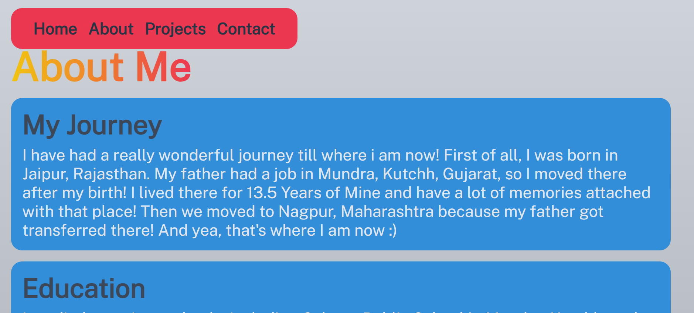
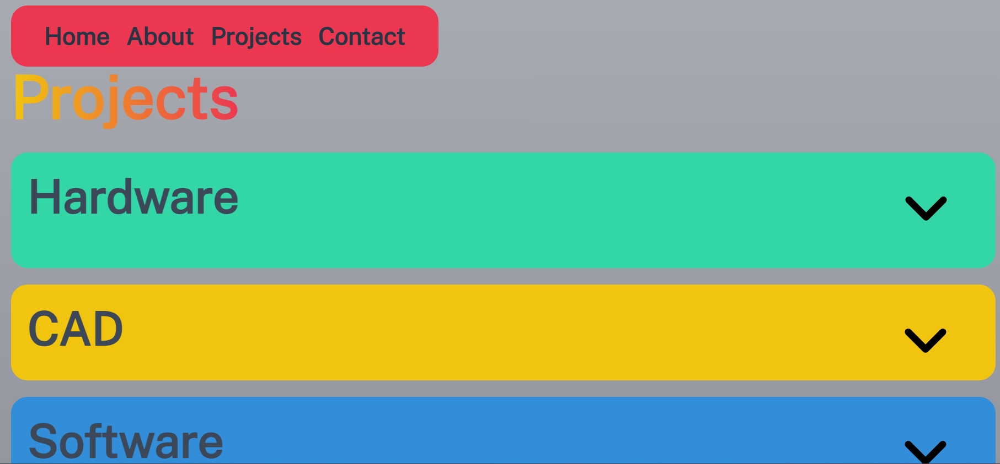
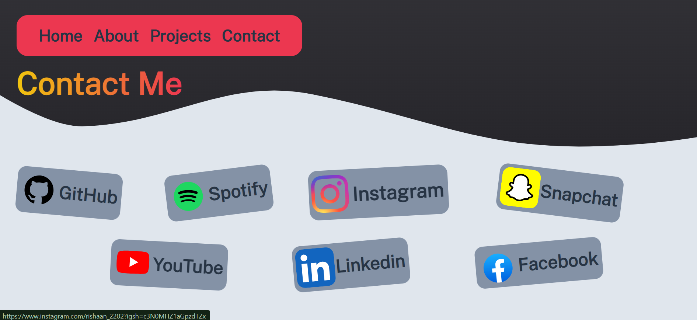

# Personal-Web-v2
The is the version-2 of my personal website which tells about me a bit! I've made this on the Hack Club community.

<h2>Demo Link</h2>
<h4>https://rishaan2202.github.io/Personal-Web-v2/</h4>

<h2>Home Page</h2>
<h4>This is the home section of my website with cool animations and stuff!</h4>
 
 

 
 
 

<h2>About Page</h2>
<h4>Here is the About page of my website with some of my personal info</h4>
 
 

 
 
 

<h2>Projects Page</h2>
<h4>This is the part where you can find out about all my cool projects made till now!</h4>
 
 

 

 
 
 

<h2>Contacts Page</h2>
<h4>This is the part where you can find out about all my cool projects made till now!</h4>
 
 

 
 
 

<h2>Thank you very much for taking a look over this, it means a lot to me!!!</h2>